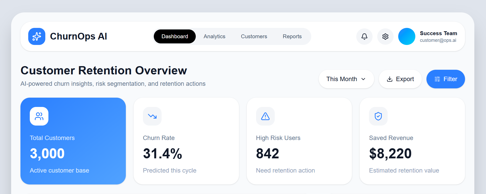
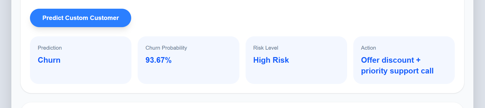
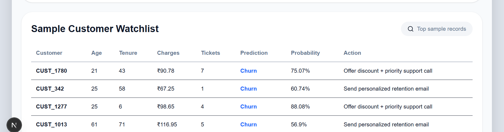
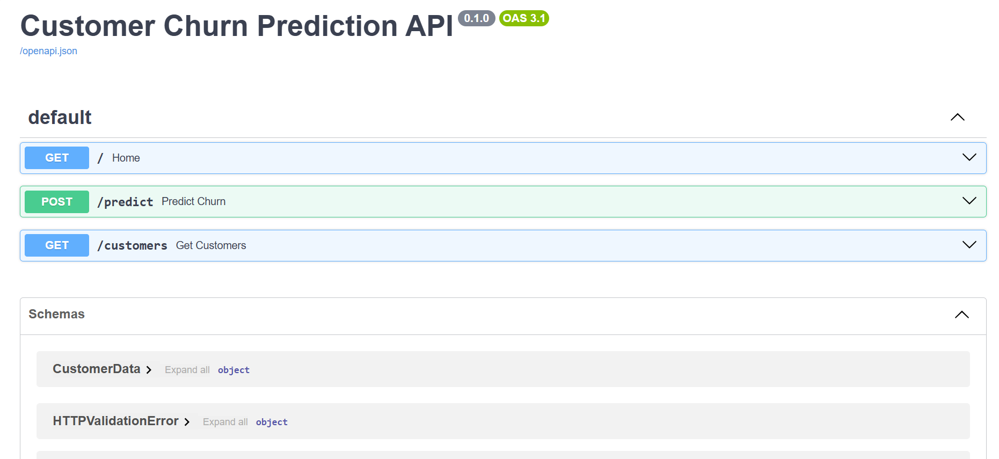
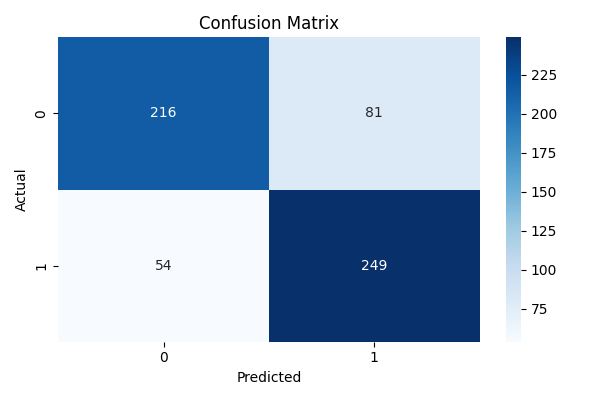
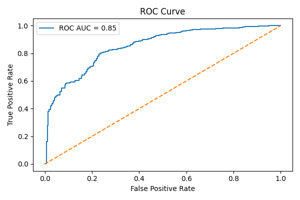
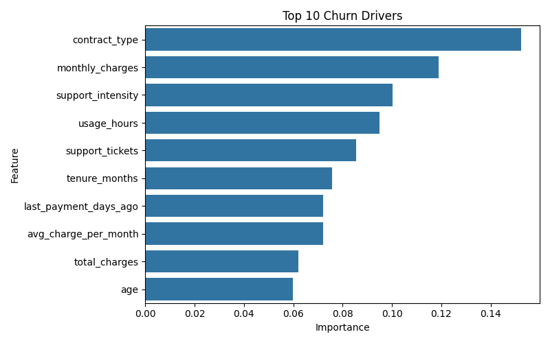

# 🚀 Customer Churn Prediction System (AI-Powered)

An **end-to-end Machine Learning + Full Stack project** that predicts customer churn, explains risk, and recommends retention actions using a **FastAPI backend** and a **premium Next.js dashboard UI**.

---

# 📌 Project Overview

Customer churn refers to customers who stop using a product/service.
For subscription-based businesses (telecom, SaaS, OTT, fintech), churn directly impacts **revenue and growth**.

This project builds a **complete churn prediction system** that:

* Predicts whether a customer will churn
* Calculates churn probability
* Categorizes risk level (High / Medium / Low)
* Suggests business actions to retain customers
* Visualizes insights in an interactive dashboard

---

# 🎯 Problem Statement

Companies often lose customers because they identify churn **too late**.

This system solves that by:

✔ Predicting churn in advance
✔ Identifying high-risk customers
✔ Helping teams take proactive action
✔ Improving retention and revenue

---

# 🧠 How Churn Simulation Works

Since real company data is not available, we simulate realistic customer behavior.

### Customers are more likely to churn when:

* Low tenure (new customers)
* High monthly charges
* Low product usage
* High support tickets
* Payment delays
* No autopay enabled
* Month-to-month contracts

👉 This creates a **pattern-based dataset**, not random — similar to real business scenarios.

---

# ⚙️ Tech Stack

## 🔹 Machine Learning

* Python
* Pandas, NumPy
* Scikit-learn
* Random Forest Classifier
* Joblib

## 🔹 Backend

* FastAPI
* Uvicorn
* Pydantic

## 🔹 Frontend

* Next.js (React)
* TypeScript
* Tailwind CSS
* Recharts
* Lucide Icons

## 🔹 Tools

* VS Code
* Git & GitHub

---

# 🏗️ Project Architecture

```text
Customer Data
     ↓
Data Cleaning
     ↓
Feature Engineering
     ↓
Model Training
     ↓
Model Evaluation
     ↓
FastAPI Backend
     ↓
Next.js Dashboard
     ↓
Prediction + Business Actions
```

---

# 📁 Folder Structure

```text
Customer-Churn-Prediction/
│
├── api/
│   └── main.py                # FastAPI backend
│
├── dashboard/
│   └── app/
│       └── page.tsx           # Next.js dashboard UI
│
├── data/
│   ├── raw/
│   │   └── customer_churn_data.csv
│   └── processed/
│       └── processed_churn_data.csv
│
├── src/
│   ├── generate_data.py
│   ├── preprocess.py
│   ├── train_model.py
│   ├── evaluate_model.py
│   └── predict.py
│
├── models/
│   ├── churn_model.pkl
│   └── model_columns.pkl
│
├── outputs/
│   └── metrics.txt
│
├── images/
│   ├── dashboard_home.png
│   ├── prediction_result.png
│   ├── customer_watchlist.png
│   ├── api_docs.png
│   ├── confusion_matrix.png
│   ├── roc_curve.png
│   └── feature_importance.png
│
├── README.md
├── requirements.txt
├── main.py
└── .gitignore
```

---

# 🧪 Machine Learning Pipeline

### Step-by-step:

1. Generate synthetic dataset
2. Clean & preprocess data
3. Encode categorical variables
4. Create new features
5. Train Random Forest model
6. Evaluate model performance
7. Save trained model
8. Serve predictions via FastAPI
9. Display results in dashboard

---

# 🤖 Model Used

### Random Forest Classifier

Why?

✔ Works well on tabular data
✔ Handles non-linear patterns
✔ Gives feature importance
✔ High accuracy & robust

---

# 📊 Model Evaluation

Metrics used:

* Accuracy
* Precision
* Recall
* F1 Score
* ROC-AUC
* Confusion Matrix

---

# 📈 Key Insights

* High churn customers:

  * Low tenure
  * High charges
  * Low usage
  * Many support tickets

* Important features:

  * Support tickets
  * Monthly charges
  * Tenure
  * Usage behavior

---

# 🔥 Retention Strategy Logic

| Risk Level  | Action                        |
| ----------- | ----------------------------- |
| High Risk   | Offer discount + support call |
| Medium Risk | Personalized retention email  |
| Low Risk    | Normal engagement             |

---

# ⚡ How to Run the Project

---

## 1️⃣ Clone Repository

```bash
git clone https://github.com/VaidehiDeore/Customer-Churn-Prediction.git
cd Customer-Churn-Prediction
```

---

## 2️⃣ Create Virtual Environment

```bash
python -m venv venv
```

Activate:

```bash
venv\Scripts\activate
```

---

## 3️⃣ Install Dependencies

```bash
pip install -r requirements.txt
```

---

## 4️⃣ Run Full ML Pipeline

```bash
python main.py
```

This runs:

```text
Data Generation → Preprocessing → Training → Evaluation
```

---

## 5️⃣ Start FastAPI Backend

```bash
$env:OPENBLAS_NUM_THREADS="1"
$env:OMP_NUM_THREADS="1"
$env:MKL_NUM_THREADS="1"
$env:NUMEXPR_NUM_THREADS="1"

python -m uvicorn api.main:app
```

Open:

```text
http://127.0.0.1:8000
http://127.0.0.1:8000/docs
```

---

## 6️⃣ Start Dashboard

```bash
cd dashboard
npm install
npm run dev
```

Open:

```text
http://localhost:3000
```

---

# 🖥️ Dashboard Features

✔ Premium SaaS-style UI
✔ Customer metrics overview
✔ Churn driver analysis
✔ Risk distribution chart
✔ Custom input prediction
✔ Real-time API integration
✔ Customer watchlist table

---

# 📸 Screenshots

### Dashboard



### Prediction Result



### Customer Watchlist



### API Docs



### Model Evaluation





---

# 📦 Model Results

* Accuracy: ~85–90%
* Strong recall for churn customers
* Balanced classification performance

---

# 🧠 Key Learnings

* End-to-end ML system building
* Data preprocessing & feature engineering
* Model training & evaluation
* FastAPI deployment
* Next.js frontend integration
* Business-driven AI solutions

---

# 🚀 Future Improvements

* CSV upload for bulk prediction
* Real-time filtering
* Export results
* SHAP explainability
* Database integration
* User authentication
* Cloud deployment (AWS/Vercel)

---

# 👩‍💻 Author

**Vaidehi Deore**
Second Year Engineering Student

Built for:

* Data Science
* Machine Learning
* Business Analytics

---

# ⭐ Final Note

This project demonstrates a **complete industry-level pipeline**:

✔ Data → Model → API → Dashboard → Business Action

---
